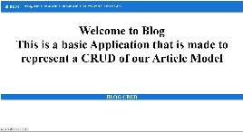

# blog

- This is a CRUD application for a Blog site written using the MERN stack in TypeScript Programming Language
- The basic premise of this application is to simulate a basic CRUD in MERN.

# Instructions on How to run the application
- Clone the Project to your machine
- Open this in your favorite text editor
- Open 2 seperate console windows in your text editor 
- Then in FrontEnd and BackEnd directories type the `npm i` command
- Then type `npm run dev` command for both directories and the go to the following localhost link that is provided in the frontend console window

# Demo

